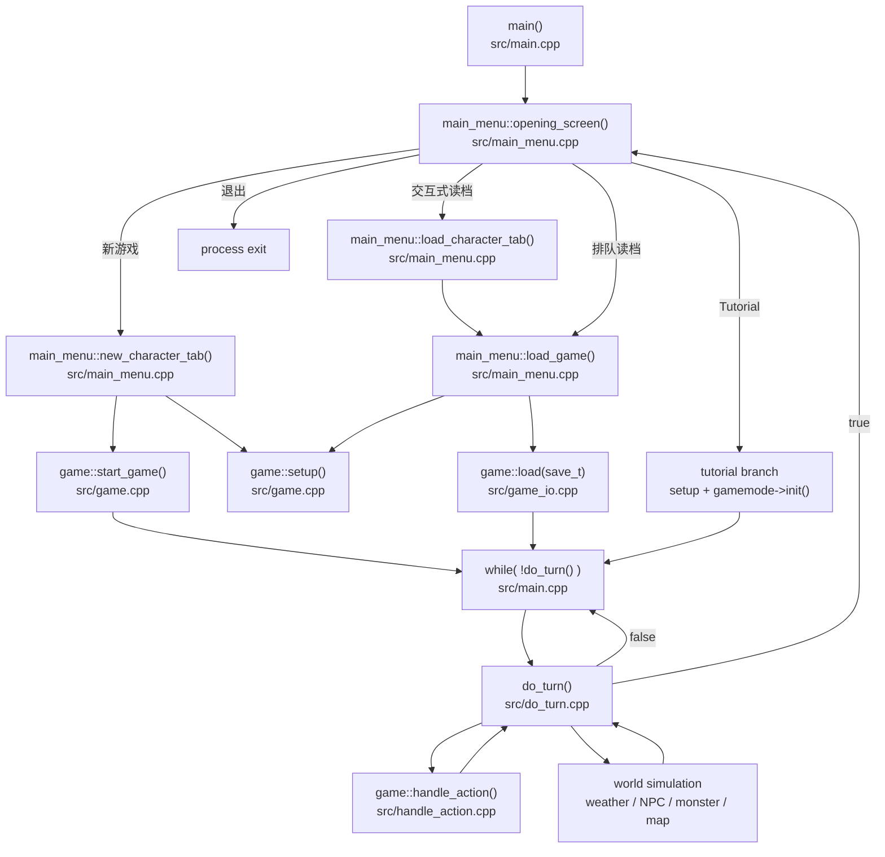

# Cataclysm-DDA 最外层 Game Loop 逻辑梳理

本文聚焦程序启动后，如何从进程入口一路进入实际游玩状态，以及“最外层 game loop”在当前代码中的真实组织方式。

先给结论：

- 整个程序的最外层运行循环在 `src/main.cpp` 的 `main()` 里。
- 实际 gameplay 阶段的最外层循环也是在 `src/main.cpp`，表现为 `while( !do_turn() ) {}`。
- 单次顶层 gameplay tick 的主体在 `src/do_turn.cpp` 的 `bool do_turn()` 中。
- 玩家输入与动作分发不在 `main()`，而是在 `do_turn()` 内继续调用 `game::handle_action()`，对应 `src/handle_action.cpp`。
- 从主菜单进入 gameplay 不只有“新游戏”和“读档”两类入口，当前代码还包含 `Tutorial` 特殊入口，以及命令行参数触发的排队读档入口。

## 1. 总体结构

可以把运行过程大致分成 3 层：

1. 程序级循环：负责主菜单、开始一局、结束后回到菜单或退出。
2. 对局级循环：负责一整局游戏的持续推进，即不断调用 `do_turn()`。
3. 回合级循环：负责单个 turn 内的玩家输入、活动处理、世界模拟和退出判断。

对应关系如下：

- 程序级循环：`src/main.cpp` -> `main()`
- 对局级循环：`src/main.cpp` -> `while( !do_turn() ) {}`
- 回合级调度：`src/do_turn.cpp` -> `bool do_turn()`

## 2. 从进程启动到进入游戏

### 2.1 入口文件与入口函数

进程入口在 `src/main.cpp:630` 附近的 `main()`。

在完成路径、语言、界面、信号处理等初始化之后，`main()` 进入真正的应用层逻辑：

```cpp
while( true ) {
    main_menu menu;
    if( !menu.opening_screen() ) {
        break;
    }

    shared_ptr_fast<ui_adaptor> ui = g->create_or_get_main_ui_adaptor();
    get_event_bus().send<event_type::game_begin>( getVersionString() );
    while( !do_turn() ) {}
}
```

这段代码定义了整个程序的最外层控制流：

- 先显示主菜单；
- 如果主菜单返回“不开始游戏”，则退出程序；
- 如果主菜单成功准备好一局可运行的游戏，则进入 `while( !do_turn() ) {}`；
- 当这一局结束后，再回到主菜单循环。

### 2.2 `main()` 与主菜单的关系

`main()` 不直接负责“新建角色”或“读取存档”，这些逻辑都在 `src/main_menu.cpp` 的 `main_menu::opening_screen()` 内完成。

调用关系是：

- `src/main.cpp` -> `main()`
- `src/main.cpp` -> `main_menu menu;`
- `src/main.cpp` -> `menu.opening_screen()`

而 `main_menu::opening_screen()` 自己内部也维护了一个菜单交互循环：

```cpp
while( !start ) {
    ui_manager::redraw();
    std::string action = ctxt.handle_input();
    ...
}
```

这里的职责是：

- 响应主菜单输入；
- 处理新游戏、读档、世界管理、设置、帮助、教程、退出等分支；
- 在用户真正完成“准备好进入一局”时返回 `true` 给 `main()`。

## 3. 主菜单如何进入一局游戏

当前代码里，主菜单进入 gameplay 主要有 4 类路径：

- 新游戏路径
- 交互式读档路径
- 教程路径
- 命令行排队读档路径

### 3.1 新游戏路径

关键函数：`src/main_menu.cpp:932` 的 `bool main_menu::new_character_tab()`

核心调用链大致是：

1. 选择 world：`world_generator->pick_world(...)`
2. 设置当前 active world：`world_generator->set_active_world( world )`
3. 初始化本局运行时数据：`g->setup()`
4. 创建角色：`pc.create( play_type )`
5. 启动新游戏：`g->start_game()`
6. 返回 `true`，告诉 `main()` 可以进入 `do_turn()` 循环

关键代码关系：

- `src/main_menu.cpp` -> `main_menu::new_character_tab()`
- `src/main_menu.cpp` -> `g->setup()`
- `src/main_menu.cpp` -> `pc.create(...)`
- `src/main_menu.cpp` -> `g->start_game()`

其中：

- `game::setup()` 在 `src/game.cpp:649`
- `game::start_game()` 在 `src/game.cpp:752`

### 3.2 交互式读档路径

这里有一个容易忽略但当前代码里真实存在的中间层。

用户在主菜单点 “Load Game” 后，并不是直接从 `opening_screen()` 进入 `load_game(...)`，而是先进入：

- `main_menu::load_character_tab( worldname )`

然后由它在所选 world 的角色存档列表里再选一个具体存档，最后才调用：

- `main_menu::load_game( worldname, savegame )`

真实调用链是：

1. `opening_screen()` 中选择某个 world
2. 调用 `load_character_tab( worldname )`
3. 列出该 world 下可加载的角色存档
4. 用户选定具体 `save_t`
5. 调用 `load_game( worldname, savegame )`
6. `load_game(...)` 内部再执行 `g->setup()` + `g->load( savegame )`

关键代码关系：

- `src/main_menu.cpp` -> `main_menu::load_character_tab(...)`
- `src/main_menu.cpp` -> `main_menu::load_game(...)`
- `src/main_menu.cpp` -> `g->setup()`
- `src/main_menu.cpp` -> `g->load( savegame )`

其中：

- `main_menu::load_character_tab(...)` 在 `src/main_menu.cpp:1117`
- `main_menu::load_game(...)` 在 `src/main_menu.cpp:1068`
- `game::load( const save_t &name )` 在 `src/game_io.cpp:319`

### 3.3 教程路径

主菜单里还有一个 `Tutorial` 分支，它不是普通“新游戏”也不是普通“读档”。

在 `opening_screen()` 中，这条路径会：

1. 创建 tutorial world
2. 设置 tutorial 专用 mod 列表
3. 调用 `g->setup()`
4. 调用 `g->gamemode->init()`
5. 令 `start = true`
6. 返回到 `main()` 并进入 `while( !do_turn() ) {}`

因此，如果文档目标是描述“进入 gameplay 的外层路径”，教程模式也应当算作一条独立入口。

### 3.4 命令行排队读档路径

`main()` 在进入菜单前会把命令行传入的 world/save 信息写入：

- `main_menu::queued_world_to_load`
- `main_menu::queued_save_id_to_load`

随后 `opening_screen()` 一开始就会检查这两个值。如果存在排队目标，则可以不经过交互式菜单选择流程，直接调用：

- `main_menu::load_game( queued_world_to_load, save_to_load )`

因此：

- “交互式读档”有 `load_character_tab()` 这一层；
- “排队读档”可以直接进入 `load_game(...)`。

## 4. 进入 gameplay 前的准备函数

### 4.1 `game::setup()` 的职责

`src/game.cpp:649` 的 `void game::setup()` 是“进入一局之前”的共用初始化入口，不管是新游戏、普通读档还是 tutorial，都会先经过它。

它当前做的事情可概括为：

- `new_game = true;`
- 加载 core data：`load_core_data()`
- 校验并加载 world mod：`load_world_modfiles()`
- 初始化 panel manager
- 重建 `map`
- 重置大量运行时状态，如任务、消息、声音、事件、统计、NPC/怪物相关缓存等
- 设置 `uquit = QUIT_NO`

因此，`game::setup()` 的定位不是“开始循环”，而是“为进入循环准备一个干净的 game runtime”。

### 4.2 `game::start_game()` 的职责

`src/game.cpp:752` 的 `bool game::start_game()` 专门负责“新开一局”时的后续构建工作。

它主要负责：

- 设置随机种子、日历、天气、安全模式、自动存档
- `load_master()`
- 确定玩家初始地点
- 预生成并准备地图
- 放置玩家、初始化开局物品与相关世界状态

只有当 `start_game()` 成功返回后，`main()` 才会进入 `while( !do_turn() ) {}`

### 4.3 `game::load()` 的职责

`src/game_io.cpp:319` 的 `bool game::load( const save_t &name )` 负责恢复已有存档。

从当前代码可以直接看出，它的加载流程不止文档里常见的前几个阶段，而是至少包含以下命名阶段：

- Master save -> `load_master()`
- Dimension data -> `load_dimension_data()`
- Character save -> `unserialize(...)`
- Map memory -> `u.load_map_memory()`
- Diary -> `u.get_avatar_diary()->load()`
- Memorial -> `memorial().load(...)`
- Finalizing

其中 `Finalizing` 阶段很重要，里面还会做：

- `u.recalc_sight_limits()`
- 若无 `gamemode` 则补建默认 `special_game`
- `init_autosave()`
- 加载角色级 autopickup / autonotes / safemode 配置
- `reload_npcs()`
- `update_map( u )`
- 一系列校验与收尾工作

所以更准确地说：

- `setup()` 先创建“可运行环境”
- `load()` 再往这个环境里恢复存档状态
- `load()` 自己内部还包含一个重要的收尾恢复阶段
- 成功之后才进入 `do_turn()`

## 5. 真正的最外层 gameplay loop

### 5.1 Loop 所在位置

实际游玩时，最外层 gameplay loop 不在 `do_turn()` 内部，而是在 `src/main.cpp:872`：

```cpp
while( !do_turn() ) {}
```

这句话的含义是：

- 每次调用 `do_turn()` 处理一次顶层 turn 推进；
- 只要 `do_turn()` 返回 `false`，就继续下一次；
- 当 `do_turn()` 返回 `true`，说明这一局已经结束，控制流回到主菜单层。

所以如果要回答“这个项目的最外层 game loop 是什么”，更准确的说法是：

- 程序级最外层循环：`main()` 里的 `while( true )`
- gameplay 阶段最外层循环：`main()` 里的 `while( !do_turn() ) {}`
- 单次顶层 turn 调度函数：`src/do_turn.cpp` 里的 `bool do_turn()`

### 5.2 `do_turn()` 的定义与边界

在 `src/do_turn.h:5`，源码已经直接标注：

```cpp
/** MAIN GAME LOOP. Returns true if game is over (death, saved, quit, etc.). */
bool do_turn();
```

在 `src/do_turn.cpp:464` 中的函数开头：

```cpp
bool do_turn()
{
    if( g->is_game_over() ) {
        return turn_handler::cleanup_at_end();
    }
    ...
}
```

因此它的边界很清楚：

- 输入：当前 `game` 全局状态
- 输出：`bool`
  - `false`：本局继续
  - `true`：本局结束，退出 `while( !do_turn() ) {}`

## 6. `do_turn()` 内部的主要结构

`do_turn()` 可以看成“每个顶层 turn 的调度器”。它本身不包揽全部细节，而是把工作分发给多个子系统。

### 6.1 回合开始阶段

`do_turn()` 开头首先处理的是“本次顶层 turn 开始时需要完成的准备逻辑”，包括：

- 首帧 `new_game` 分支
- 否则执行 `g->gamemode->per_turn()`
- 否则推进世界时间：`calendar::turn += 1_turns`
- 音乐、天气温度缓存
- 按需加载 NPC：`g->load_npcs()`
- 处理计时事件：`timed_events.process()`
- 处理任务：`mission::process_all()`
- 更新玩家身体状态：`u.update_body()`
- 自动存档：`g->autosave()`
- 更新天气：`weather.update_weather()`

这里有一个很容易误解的点：

- `game::setup()` 会把 `new_game` 设成 `true`
- `game::start_game()` 也会把 `new_game` 设成 `true`
- `game::load( save_t )` 本身不会先把它重置成 `false`

所以当前代码下，`do_turn()` 里的 `if( g->new_game )` 并不只是“新开局首回合逻辑”，它同样会覆盖“刚完成 `setup()` 后首次进入 `do_turn()` 的情况”，包括读档后的第一帧。它更准确的含义是：

- “进入当前 game runtime 后的第一次顶层 `do_turn()` 特殊处理”

### 6.2 玩家活动预处理

在进入输入循环之前，`do_turn()` 还会先处理一些“不需要立刻等待输入”的活动：

```cpp
while( u.get_moves() > 0 && u.activity ) {
    u.activity.do_turn( u );
}
```

说明单个顶层 turn 中，玩家可能先持续执行已有 activity，而不是立刻再次读输入。

### 6.3 单个 turn 内最关键的输入循环

真正与玩家交互最直接的内层循环在 `src/do_turn.cpp:571` 附近：

```cpp
while( u.get_moves() > 0 || g->uquit == QUIT_WATCH ) {
    m.process_falling();
    g->cleanup_dead();
    g->mon_info_update();
    ...
    if( g->handle_action() ) {
        ++g->moves_since_last_save;
        u.action_taken();
    }

    if( g->is_game_over() ) {
        return turn_handler::cleanup_at_end();
    }

    if( g->uquit == QUIT_WATCH ) {
        break;
    }

    while( u.get_moves() > 0 && u.activity ) {
        u.activity.do_turn( u );
    }
}
```

这段代码说明了 4 件关键事情：

1. `do_turn()` 内部还有一个“单回合内的动作循环”。
2. 玩家只要还有 moves，就可能持续执行多个动作。
3. 真正的输入分发点是 `g->handle_action()`。
4. 每次动作后都可能触发 game over 检查并提前结束整局。

因此：

- `main()` 的 `while( !do_turn() ) {}` 是对局级 loop
- `do_turn()` 内的 `while( u.get_moves() > 0 ... )` 是单 turn 内的动作级 loop

## 7. `handle_action()` 在最外层 loop 中的角色

`src/handle_action.cpp:3167` 的 `bool game::handle_action()` 是玩家输入与动作执行的主分发函数。

它的大致职责是：

- 如果角色处于自动移动，转成对应 action
- 如果角色到达自动移动目标后有目的地 activity，则先启动它
- 如果有延迟打开的菜单，则先执行菜单
- 否则调用 `get_player_input( action )` 获取输入
- 将输入解析为 `action_id`
- 针对不同 action 进入对应处理逻辑

也就是说，当前文件间关系是：

- `src/main.cpp` 决定“是否继续下一次 `do_turn()`”
- `src/do_turn.cpp` 决定“这一轮是否继续让玩家行动，以及何时做世界推进”
- `src/handle_action.cpp` 决定“玩家这一次输入到底要执行什么”

这三者构成最外层 gameplay control flow 的主骨架。

## 8. 回合末的世界模拟

当玩家动作阶段结束后，`do_turn()` 会进入世界模拟部分，继续处理：

- `m.build_floor_caches()`
- `m.process_falling()`
- `m.vehmove()`
- `m.process_fields()`
- `m.process_items()`
- `sounds::process_sounds()`
- `m.build_map_cache(...)`
- `monmove()`
- `overmap_npc_move()`

这说明：

- `do_turn()` 不只是“读一次输入”；
- 它完整包裹了一个 turn 从玩家动作到世界 / NPC / 怪物更新的全过程。

因此从架构角度，`do_turn()` 是“单个顶层 turn 的 scheduler”。

## 9. 退出条件如何向外层传播

退出逻辑主要通过两层机制传播：

### 9.1 `uquit` / `is_game_over()`

玩家在菜单、死亡、保存退出、旁观等情况下，会修改 `g->uquit`。随后 `do_turn()` 多次调用：

- `g->is_game_over()`

一旦判定整局结束，就执行：

- `turn_handler::cleanup_at_end()`

并把结果返回给 `main()`。

### 9.2 `do_turn()` 的返回值

这是与外层 loop 的直接接口：

- `false` -> `main()` 继续下一次 `do_turn()`
- `true` -> `main()` 跳出当前对局循环，回到主菜单循环

所以 `do_turn()` 是对局生命周期的收口点。

## 10. 文件与函数交互总表

### 10.1 程序级主路径

```text
src/main.cpp
  main()
    -> main_menu::opening_screen()              [src/main_menu.cpp]
    -> while( !do_turn() ) {}                   [src/do_turn.cpp]
```

### 10.2 新游戏路径

```text
src/main.cpp
  main()
    -> main_menu::opening_screen()              [src/main_menu.cpp]
      -> main_menu::new_character_tab()         [src/main_menu.cpp]
        -> game::setup()                        [src/game.cpp]
        -> avatar::create(...)                  [avatar/character creation path]
        -> game::start_game()                   [src/game.cpp]
    -> while( !do_turn() ) {}
```

### 10.3 交互式读档路径

```text
src/main.cpp
  main()
    -> main_menu::opening_screen()              [src/main_menu.cpp]
      -> main_menu::load_character_tab()        [src/main_menu.cpp]
        -> main_menu::load_game(...)            [src/main_menu.cpp]
          -> game::setup()                      [src/game.cpp]
          -> game::load(save_t)                 [src/game_io.cpp]
    -> while( !do_turn() ) {}
```

### 10.4 教程路径

```text
src/main.cpp
  main()
    -> main_menu::opening_screen()              [src/main_menu.cpp]
      -> tutorial branch
        -> game::setup()                        [src/game.cpp]
        -> gamemode->init()
    -> while( !do_turn() ) {}
```

### 10.5 命令行排队读档路径

```text
src/main.cpp
  main()
    -> main_menu::queued_world_to_load / queued_save_id_to_load
    -> main_menu::opening_screen()              [src/main_menu.cpp]
      -> main_menu::load_game(...)              [src/main_menu.cpp]
        -> game::setup()                        [src/game.cpp]
        -> game::load(save_t)                   [src/game_io.cpp]
    -> while( !do_turn() ) {}
```

### 10.6 单次 turn 路径

```text
src/main.cpp
  while( !do_turn() ) {}
    -> do_turn()                                [src/do_turn.cpp]
      -> game::is_game_over()                   [src/game.cpp]
      -> new_game first-frame branch / gamemode->per_turn()
      -> timed_events.process()
      -> mission::process_all()
      -> weather.update_weather()
      -> while( u.get_moves() > 0 ... )
           -> game::handle_action()             [src/handle_action.cpp]
           -> game::is_game_over()              [src/game.cpp]
           -> activity.do_turn(...)
      -> monmove()
      -> overmap_npc_move()
      -> turn_handler::cleanup_at_end()         [结束时]
```

## 11. Mermaid 调用关系图



## 12. 最终结论

如果只用一句话概括这个项目当前代码的最外层 game loop：

> `main()` 先通过 `main_menu::opening_screen()` 准备出一个可运行的 `game`，然后使用 `while( !do_turn() ) {}` 持续推进整局游戏，而 `do_turn()` 本身再在内部调用 `game::handle_action()` 与各类世界更新逻辑，完成单个顶层 turn 的完整处理。

更精确地说：

- 整个程序的最外层循环：`src/main.cpp` 的 `while( true )`
- gameplay 阶段的最外层循环：`src/main.cpp` 的 `while( !do_turn() ) {}`
- 单个 turn 的核心调度函数：`src/do_turn.cpp` 的 `bool do_turn()`
- 玩家动作分发核心：`src/handle_action.cpp` 的 `bool game::handle_action()`
- 主菜单进入 gameplay 的入口不止一条，至少包括：新游戏、交互式读档、Tutorial、排队读档

## 13. 关键源码定位

- `src/main.cpp:630` - `main()`
- `src/main.cpp:864` - 程序级循环 `while( true )`
- `src/main.cpp:872` - 对局级循环 `while( !do_turn() ) {}`
- `src/main_menu.cpp:578` - `main_menu::opening_screen()`
- `src/main_menu.cpp:932` - `main_menu::new_character_tab()`
- `src/main_menu.cpp:1068` - `main_menu::load_game(...)`
- `src/main_menu.cpp:1117` - `main_menu::load_character_tab(...)`
- `src/game.cpp:649` - `game::setup()`
- `src/game.cpp:752` - `game::start_game()`
- `src/game_io.cpp:319` - `game::load( const save_t &name )`
- `src/do_turn.h:5` - `do_turn()` 注释声明为 `MAIN GAME LOOP`
- `src/do_turn.cpp:464` - `bool do_turn()`
- `src/handle_action.cpp:3167` - `bool game::handle_action()`
